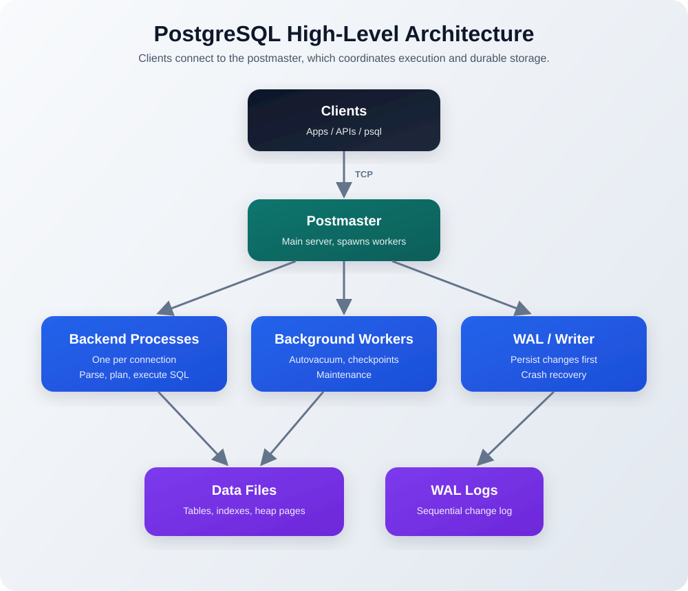
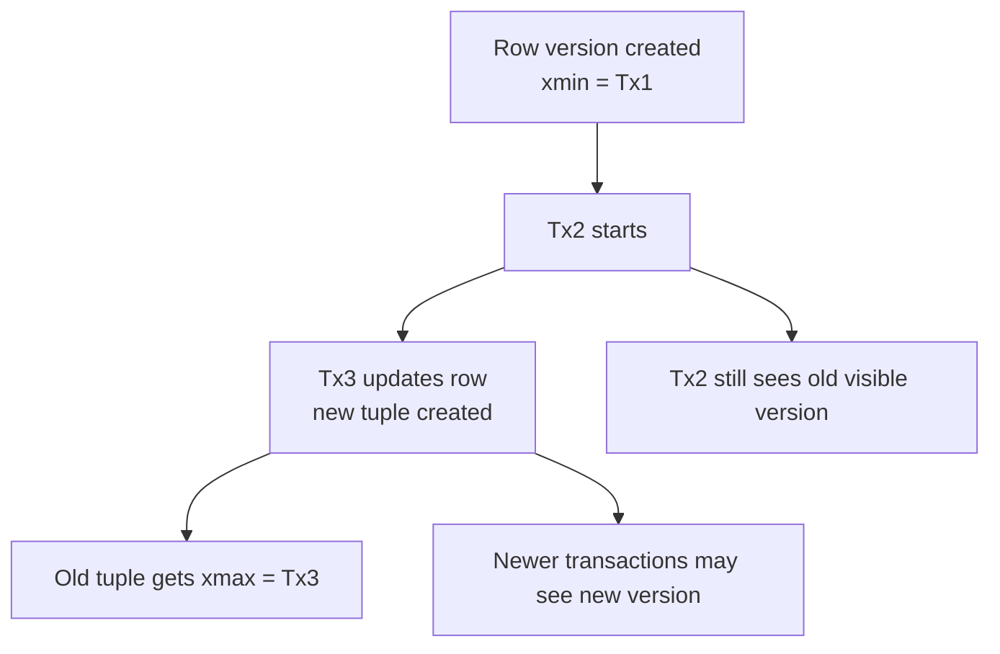
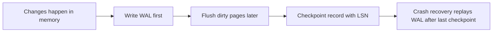

# PostgreSQL

## What It Is

PostgreSQL is a relational database, more precisely an object-relational database.

It gives you:

- tables, rows, keys, joins
- transactions and ACID guarantees
- custom types, functions, arrays, JSON/JSONB
- strong reliability and concurrency support

## Core Idea

Postgres separates:

- query logic: parsing, planning, executing SQL
- storage: pages, tuples, files, WAL

That split helps with flexibility, performance, and crash recovery.

## ACID

- `Atomicity`: a transaction fully succeeds or fully fails
- `Consistency`: data stays valid before and after a transaction
- `Isolation`: concurrent transactions do not corrupt each other
- `Durability`: committed data survives crashes

## High-Level Architecture

### Main Pieces

- `Postmaster`: main server process
- `Backend process`: one process per active client connection
- `Background workers`: vacuum, checkpoints, caching-related work
- `WAL processes`: write-ahead logging and recovery support
- `Data cluster`: on-disk directory holding databases, tables, indexes, WAL, and metadata

## Storage Model

### Heap Storage

- each table is stored as one or more heap files
- files are split into fixed `8 KB` pages
- rows are not stored in sorted physical order by default

### What Is Inside a Page

- page header: metadata
- item pointers: offsets to rows
- tuples: actual row versions

### Tuple

A tuple is Postgres's internal row representation.

It stores:

- row data
- `xmin`: transaction that created it
- `xmax`: transaction that deleted it, if any
- visibility metadata for MVCC

## TOAST

Problem:

- a full row must fit in one `8 KB` page
- large values like big text, `JSONB`, or `bytea` may not fit well

Solution:

- compress the value first
- if still too large, store it out-of-line in a TOAST table
- keep only a small reference in the main row

Why it matters:

- main table rows stay smaller
- scans are faster when large values are not needed

## MVCC

MVCC = Multi-Version Concurrency Control.

Goal:

- readers should not block writers
- writers should not block readers

How it works:

- updates do not overwrite rows in place
- each update creates a new row version
- each transaction reads the version visible to its own snapshot

### Visibility Rule

A tuple is visible when:

- its `xmin` is committed and old enough for the transaction snapshot
- its `xmax` is empty, or not yet effective for that snapshot

### Trade-Off

- old row versions accumulate
- `autovacuum` cleans dead tuples and reclaims reusable space

## WAL and Durability

WAL = Write-Ahead Logging.

Rule:

- changes are written to WAL before the main data files are updated

Why:

- after a crash, Postgres can replay WAL
- sequential WAL writes are faster than random data-page writes
- WAL also supports replication

### Replication

- replicas stream WAL
- replicas replay WAL to stay close to primary
- this powers read replicas and failover setups

## Checkpoints

A checkpoint is a sync point between memory and disk.

At checkpoint time:

- dirty pages are flushed to data files
- a checkpoint record is written to WAL
- that record includes an `LSN` (Log Sequence Number)

Why it matters:

- crash recovery only needs WAL after the last checkpoint
- fewer checkpoints can improve write performance
- more frequent checkpoints can reduce recovery time

## Quick Memory Refresh

- Postgres is relational plus object-relational features
- tables live in heap files made of `8 KB` pages
- rows are tuples with `xmin` and `xmax`
- MVCC gives snapshot-based non-blocking reads
- WAL guarantees durability and enables recovery/replication
- checkpoints reduce recovery work after crashes
